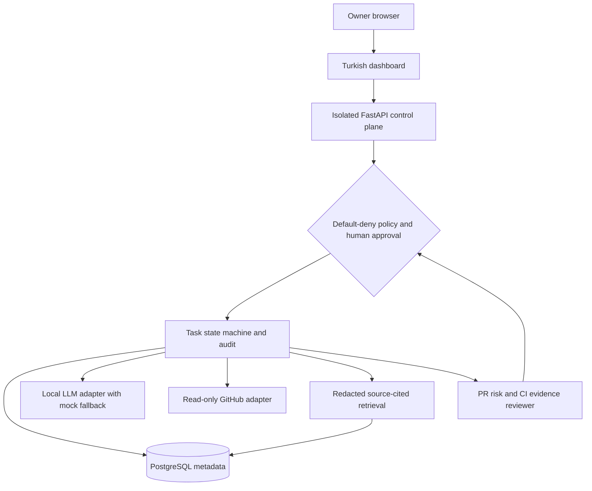
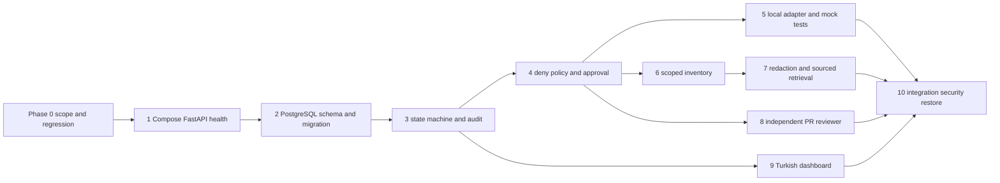

# OMEGA target architecture and dependency milestones

**Conceptual MVI design only**: this diagram is not a deployed system.

## Delivery dependency graph

## Milestones
- P0A: agreed narrow scope, owner device UNKNOWN until measured, existing roadmap preserved.
- P0B: 100-row requirement matrix, ADRs, threat/data classification tests and accountable approvals.
- P0C: dummy-only Compose and FastAPI health without real secrets, with reproducible tests.
- MVI-A: DB and state+audit/policy tests.
- MVI-B: mock model + read-only GitHub + redacted RAG + PR reviewer.
- MVI-C: Turkish UI, full CI gates and restore rehearsal with non-sensitive dummy data.
- Later: remaining 100-step requirements after validated MVI, separately authorized integrations and hardware measurements.

## Recovery design (not a backup)
Backups must be encrypted *on the client* before Drive upload; key managed separately in an approved secret store. Attach manifest of file names, versions, non-sensitive provenance and SHA-256 hashes (ciphertext integrity) plus signed/authenticated encryption metadata. Perform restore on a clean sandbox with dummy data, validate hashes and usability, document RTO/RPO. No private upload or backup-success claim until encryption, owner approval and restore tests are passed.
